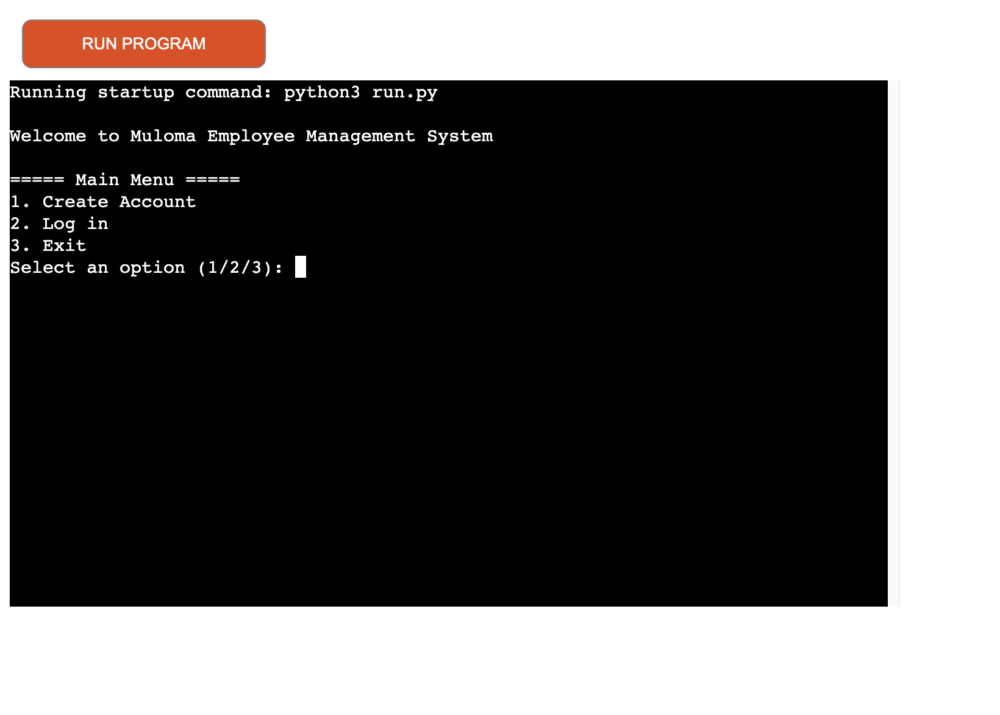

# MULOMA Employee Management System (MEMS)
---
## Contents

* [Introduction](<#introduction>)
* [Objective](<#objective>)
* [User Experience](<#user-experience>)
  * [Project Goals](<project-goals>)
  * [Target Users](<target-users>)
  * [User Stories](<#user-stories>)
* [Design](<#design>)
  * [Program Flowchart](<#program-flowchart>)
* [Data Handling and Storage](<#data-handling-and-storage>)
* [Credits](<#credits>)
* [Acknowledgement](<#acknowledgement>)
* [Statement](<#statement>)
---

## Introduction
Muloma Employee Management System (MEMS) is a command-line application designed to automate and streamline employee registration, shift planning, and attendance tracking. This backend application is built using Python and is hosted on Heroku.

The project was conceived from a desire to assist a friend who recently started an agro-tourism business and faced challenges in managing employees. MEMS is specifically tailored to support small-scale farming organizations in effectively managing their workforce.

You can view the live site [here](https://muloma-employee-management-2bad7d73f50a.herokuapp.com/).

---
## Ojective 
The objective of the Muloma Employee Management System (MEMS) is to automate and streamline employee registration, shift planning, and attendance tracking through a command-line application. This project is designed to assist small-scale farming organizations, particularly in the agro-tourism sector, by enabling them to register employees, create unique IDs, and maintain a comprehensive database. The system will also allow employees to view their planned shifts. Ultimately, MEMS aims to help organizations effectively manage 

---

## User Experience
### Project Goals
As owner, I want the application to achieve the following:
*	Allow farming busnesses to capture and store the data of employees at registration.
*	Generate a uniqe identification (ID) number for all employees
*	Automate the planning of shifts for employees based on data provided at time of registration 
*	Allow employees to view their planned shifts for the next two months.
*	Allow businesses to track and record employee attendance 
---

### Taeget Users

This application is designed for small-scale organizations, particularly farmers and their employees.

### User Stories
*	As a user, I want to input data and receive prompts when actions fail.
*	As a user, I want to generate a unique employee ID after entering and verifying my data.
*	As a user, I want the system to generate planned shifts based on the provided information.
*	As a user, I want to view all planned shifts.
*	As a user, I want to track shifts by recording hours worked, including start, pause, resume, and end times.

---

## Design

### Program flowchart
To guide the design and manage the scope of the project, I created a simple program flowchart using Lucidchart.
As illustrated in the chart below, the program starts at the entry point, which opens the main menu. Users can then choose to log in if they already have an account or create a new account if they do not.
After creating an account, planned shifts are automatically generated based on employee data. Employees can then log in using their credentials.
Once logged in, users can access the shift menu and decide to either start a shift, view planned shifts, or check the data of completed shifts. The program will eventually end and return to the main menu.

---
## Data Handling and Storage
The data for this application is stored in a Google Sheets document. You can access the spreadsheet [here](https://docs.google.com/spreadsheets/d/1GpKqkg6_-KFyMNKCAM9EdVTOf4sjo6B9d3YhpnniA74/edit?gid=0#gid=0).

---
## Credits
I learned how to create a short unique ID from the YouTube tutorial by [Cod Fix](https://www.youtube.com/watch?v=9M383pbjTAQ).

ChatGPT served as a valuable reference and learning guide throughout the project, assisting with debugging and editing the README document.

The YouTube video by [Web Code](https://www.youtube.com/watch?v=Qnbgk57n5pE) was a source of inspiration for this project.

The website's design and inspiration were influenced by the "Love Sandwiches" walkthrough project from the Code Institute's Full Stack Software Development Diploma course.

I used the [CI Python Linter](https://pep8ci.herokuapp.com/) to validate my Python code.

## Acknowledgement
I would like to express my gratitude to my mentor, Akshat Gar, and my cohort facilitator, Kay Welfare, for their invaluable guidance and support. I also appreciate the honest feedback and direction provided by my classmate.

## Statement
Due to time pressure contents of this README document is missing some important contents

